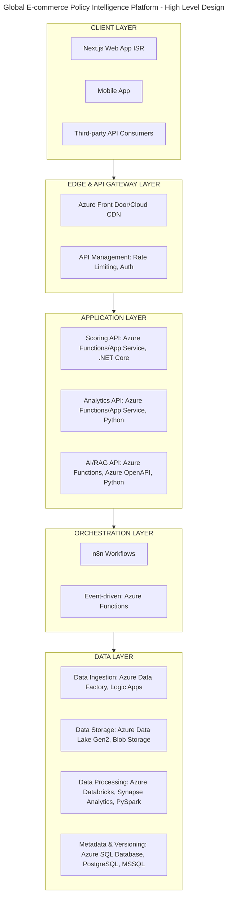

# Global E-commerce Policy Intelligence Platform - Architecture Design

## Real-World Scenario

**Platform Purpose**: A government agency needs to monitor e-commerce competitiveness across 100+ countries, forecast labor market trends, analyze ESG compliance, and simulate policy impacts using AI-powered insights.

**Business Requirements**:

- Ingest data from 50+ heterogeneous sources (APIs, CSVs, PDFs, real-time feeds)
- Calculate composite indices with versioned methodologies
- AI-powered document analysis and policy recommendations
- Interactive dashboards for policymakers
- Reproducible, auditable results
- Multi-tenant support (different government agencies)
- 99.9% uptime SLA

----

## High-Level Architecture Overview

----

